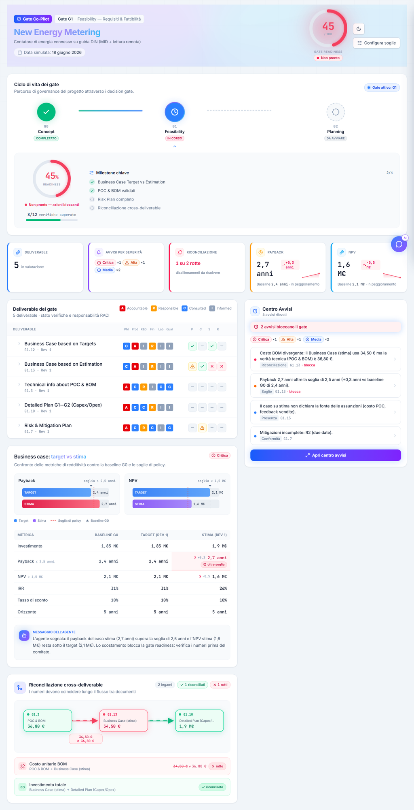

# Gate Co-Pilot — Dashboard di Gate Governance (Hackathon GEWISS)



Dashboard web che dimostra un **agente AI orchestratore** per la governance dei
decision gate di un'azienda manifatturiera (GEWISS). L'agente assiste il Project
Manager: ingerisce i deliverable di un gate da una "cartella di rete", li verifica
contro i criteri di accettazione aziendali (reference pack GEWISS) e **instrada gli
avvisi** alle persone giuste in base al **ruolo RACI** e alla **severità**.

> L'agente **assiste, non decide**: segnala, spiega citando il criterio violato e
> propone l'azione; la firma resta all'umano _Accountable_.

Caso demo: **New Energy Metering** — contatore di energia connesso su guida DIN
(MID + lettura remota), al gate **G1 — Feasibility**.

---

## Novità v2 — la PM dashboard definitiva

La v2 trasforma la dashboard funzionale in uno strumento **premium** per il Project
Manager, con massimo impatto visivo per la demo:

- 🌑 **Design system premium + dark mode di default.** Glassmorphism, gradient,
  glow, micro-animazioni GPU-accelerated; **toggle dark/light** in header (la scelta
  persiste, no flash all'avvio). Font **Inter** (UI) + **JetBrains Mono** (numeri/dati).
- 🗺️ **Gate Timeline** (componente eroe): stepper visivo del ciclo di vita
  **G0 → G1 → G2**. G0 _passed_ (verde, check), **G1 _active_** (anello gradient
  rotante + pulse, blu), G2 _upcoming_ (tratteggiato). Card espandibile sul gate
  attivo con **Gate Readiness radiale animato**, milestone e verifiche superate.
- 🤖 **Chatbot "Gate Co-Pilot AI"** (pannello slide-in): il PM interroga in
  linguaggio naturale lo stato del gate, le anomalie, il Business Case, i rischi,
  la riconciliazione e il routing RACI. Risposte **ancorate ai dati reali**
  dell'engine, con citazioni ai documenti, effetto _typing_ e domande rapide.
- ✨ **Componenti ridisegnati:** header con readiness radiale, KPI con _count-up_
  e sparkline, tabella deliverable a righe espandibili, alert feed con priorità
  visiva, **riconciliazione a mini-grafo SVG**, business case con bar chart
  Target vs Stima, anteprima notifiche a tab per ruolo, drawer soglie con
  **anteprima live** di avvisi e readiness mentre trascini.
- 🎬 **Animazioni d'ingresso in stagger** dopo la scansione, loading con messaggi
  dinamici e progress bar, **onda visiva** al cambio soglie.

> ⚙️ **Il motore logico non è cambiato.** I 4 livelli di controllo, la formula di
> Gate Readiness, le severità e il routing RACI sono identici alla v1: cambia solo
> la presentazione. I 5 scenari del seed scattano esattamente come prima
> (Gate Readiness **45/100**).

---

## Avvio

```bash
npm install
npm run dev
```

L'app gira **completamente offline con dati mock**: nessuna chiave, nessun backend,
nessun servizio esterno. Apri l'URL mostrato da Vite e premi **"Scansiona cartella di
rete"** per popolare la dashboard con il seed.

Build di produzione: `npm run build` · anteprima: `npm run preview`.

Verifica del motore (i 5 scenari attesi): `npx tsx scripts/verify-engine.ts`.

---

## Cosa fa il motore (4 livelli di controllo)

Il cuore è un **motore deterministico a 4 livelli** ([src/engine/checks.ts](src/engine/checks.ts))
che, dati i deliverable + le soglie + la baseline di progetto, produce dei `Finding`.
Ogni finding cita il **criterio "accept only if…"** violato e propone l'azione.

| Livello             | Cosa verifica                                                        |
| ------------------- | -------------------------------------------------------------------- |
| **Presence**        | I campi obbligatori sono presenti (indicatori + tasso/orizzonte)?    |
| **Conformance**     | Il contenuto rispetta i bullet "accept only if…" (comparabilità, owner/data dei rischi)? |
| **Threshold**       | Il valore è dentro la policy (`payback ≤ max`, `NPV ≥ min`) e vs baseline G0? |
| **Reconciliation**  | I numeri coincidono tra documenti/revisioni (tolleranza in €)?       |

Severità e **Gate Readiness** in [src/engine/severity.ts](src/engine/severity.ts):

```
Gate Readiness = clamp(100 − 30·#Critical − 15·#High − 5·#Medium, 0, 100)
Bande: ≥85 verde · 60–84 ambra · <60 rosso
```

Routing RACI delle notifiche in [src/engine/routing.ts](src/engine/routing.ts):
ogni anomalia genera messaggi **diversi per ruolo** (Accountable: serve decisione/firma;
Responsible: correggi questo; Consulted: serve il tuo parere; Informed: FYI), con canale
coerente alla severità (`direct` / `dashboard` / `digest`).

Con il seed, il Gate Readiness è **45/100 (rosso)**: 1 Critical + 1 High + 2 Medium.

---

## Mappatura ai criteri del reference pack GEWISS

I criteri provengono dal reference pack ufficiale (`gate_templates.json`, gate **G1**:
deliverable `business_case_targets_g1`, `business_case_estimation_g1`, `risk_mitigation_g1`,
`poc_bom`). Corrispondenza check ↔ criterio "accept only if…":

| Check (livello)                  | Criterio del pack (parafrasato)                                                                 | Esito sul seed |
| -------------------------------- | ----------------------------------------------------------------------------------------------- | -------------- |
| Presence — indicatori + tasso/orizzonte | Business Case: "indicatori standard (investimento, payback, NPV, IRR) + **tasso di sconto e orizzonte temporale dichiarati**" | pass (presenti) |
| Presence — fonte assunzioni      | Business Case (Estimation): "**assunzioni e fonti dichiarate**" — input di stima senza fonte non è tracciabile | **warn → Media** |
| Conformance — comparabilità      | Estimation: "stesso set indicatori, **stesso tasso/orizzonte del caso target**" (i due scenari devono essere confrontabili) | pass (comparabili) |
| Conformance — rischi             | Risk & Mitigation Plan: "ogni rischio significativo ha mitigazione concreta, **owner e data**"   | **warn → Media** (R2 senza due date) |
| Threshold — payback / NPV        | Policy GEWISS: `payback ≤ 2,5 anni`, `NPV ≥ 1,5 M€`; allineato alla baseline G0                  | **fail → Alta** (payback 2,7) |
| Reconciliation — BOM             | Coerenza cross-documento: il costo BOM del Business Case deve coincidere col roll-up tecnico (POC & BOM) | **fail → Critica** (34,50 ≠ 36,80) |
| Reconciliation — investimento    | L'investimento del Business Case deve riconciliare col Detailed Plan (Capex/Opex)               | pass (1,9 = 1,9) |

### I 5 scenari che scattano con il seed

1. **Payback 2,7 > 2,5** → Threshold `fail` → **Alta**, instradato a Finance (R) + Product Manager (A).
2. **BOM 34,50 ≠ 36,80** → Reconciliation `fail` → **Critica** (vista Riconciliazione).
3. **Estimation senza fonte assunzioni** → Presence `warn` → **Media**.
4. **Investimento 1,9 = 1,9** (G1.13 ↔ G1.10) → Reconciliation `pass` (verde).
5. **Rischio R2 senza due date** → Conformance `warn` → **Media**.

---

## Note importanti

- **Difetto seminato di proposito.** In `G1.13` (Business Case su stima) il costo BOM
  usato è **34,50 €**, mentre la verità tecnica in `G1.3` (POC & BOM) è **36,80 €**.
  Questo genera l'anomalia di **riconciliazione Critica** — è voluto, per mostrare il
  controllo cross-deliverable.

- **RACI: cosa è ufficiale e cosa è placeholder.** Solo le RACI di **Business Case**
  (G1.12, G1.13) e **Risk & Mitigation Plan** (G1.7) sono prese dal reference pack
  GEWISS. Le RACI di **G1.3** (POC & BOM) e **G1.10** (Detailed Plan Capex/Opex) sono
  placeholder ragionevoli, non ufficiali.

- **AI opzionale (chatbot + riformulazione).** Se imposti `VITE_ANTHROPIC_API_KEY` in un
  file `.env` (vedi `.env.example`), due funzioni usano l'Anthropic Messages API (modello
  `claude-sonnet-4-6`): **(1)** il chatbot _Gate Co-Pilot AI_ risponde con il modello
  reale (badge "AI reale"); **(2)** il pulsante "Riformula con AI" nell'anteprima notifiche
  riscrive i messaggi per ruolo. **Senza chiave la demo funziona al 100%**: il chatbot usa
  un **responder mock** che resta ancorato ai dati reali dell'engine (le risposte cambiano
  se cambi le soglie) e le notifiche usano i template.

- **Soglie editabili in tempo reale.** Dal drawer "Configura soglie" puoi modificare,
  es., il payback massimo: portandolo a `3.0` l'avviso sul payback **sparisce subito**;
  riportandolo a `2.5` ricompare. Tutto si ricalcola via l'hook `useEngine`.

---

## Stack & struttura

**React + Vite + TypeScript + Tailwind CSS v4** · icone `lucide-react` · stato in memoria.

```
src/
├── types.ts                 # tipi del dominio (+ GateInfo per la timeline)
├── data/seed.ts             # dati mock (New Energy Metering, G1) + GATE_TIMELINE
├── engine/
│   ├── checks.ts            # motore 4 livelli (presence/conformance/threshold/reconciliation)
│   ├── severity.ts          # severità + Gate Readiness
│   ├── routing.ts           # routing RACI delle notifiche
│   ├── ai.ts                # riformulazione AI opzionale (dietro flag)
│   └── chatbot.ts           # responder del chatbot (mock ancorato all'engine + API opzionale)
├── hooks/
│   ├── useEngine.ts         # riesegue i check quando cambiano soglie/seed
│   ├── useTheme.ts          # tema dark/light (class-based su <html>)
│   └── useCountUp.ts        # numeri animati (rispetta prefers-reduced-motion)
├── lib/
│   ├── format.ts            # formattazioni it-IT
│   └── markdown.tsx         # mini-renderer markdown→React (per le risposte del chatbot)
├── components/              # Header, GateTimeline, KpiRow, DeliverableTable, AlertFeed,
│                            # ReconciliationView, BusinessCaseDeepDive, NotificationPreview,
│                            # ThresholdDrawer, ChatPanel, SeverityBadge, RaciChip, CheckIndicator
├── index.css                # design system premium (dark default, glass, animazioni)
└── App.tsx                  # orchestrazione + layout + tema + chatbot
```

I dati e i criteri derivano dal materiale GEWISS (`GateGovernanceApp/config/gate_templates.json`
e reference pack). I numeri del seed sono illustrativi ma internamente coerenti.

---

## Screenshot per la presentazione

Per la giuria, cattura (in **dark mode**, default):

1. **Vista d'insieme** dopo la scansione: header con Gate Readiness radiale rosso
   (45/100), Gate Timeline con G1 attivo pulsante, KPI con numeri animati.
2. **Gate Timeline** in primo piano: G0 verde _passed_, G1 blu _active_ (anello
   rotante) con card radiale espansa, G2 _upcoming_ tratteggiato.
3. **Chatbot aperto** su "Quali anomalie bloccano il gate?" — risposta con BOM
   Critico e payback Alto, citazioni ai documenti.
4. **Riconciliazione** a mini-grafo con l'arco rosso BOM (34,50 ≠ 36,80).
5. **Drawer soglie**: trascinando il payback massimo, l'anteprima live mostra
   avvisi e readiness che cambiano in tempo reale.
6. **Toggle light mode** per mostrare che entrambi i temi sono rifiniti.
